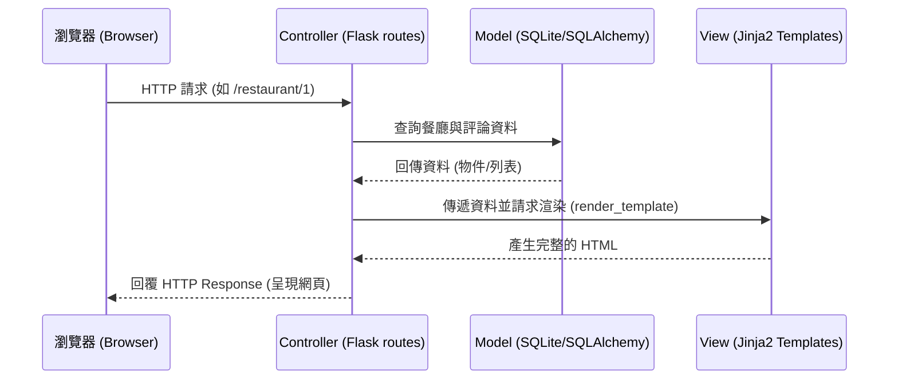

# 系統架構設計 (ARCHITECTURE)

根據 PRD，本專案為「校園美食推薦平台」，為提供初學者友善且可在一週內完成的開發環境，我們選用 Flask + Jinja2 + SQLite 作為核心技術，不採用前後端分離，統一由 Flask 控制視圖渲染。

## 1. 技術架構說明

### 選用技術與原因
- **後端框架：Python + Flask**
  - 原因：Flask 輕量、彈性大，適合快速打造 Prototype。且 Python 語法直觀，適合初學者學習並實作地圖、搜尋及資料庫連結等邏輯。
- **模板引擎：Jinja2**
  - 原因：內建於 Flask 中，能夠直接在 HTML 裡面撰寫迴圈與條件判斷（如列出餐廳清單、判斷是否登出或登入），能不依賴複雜的前端框架快速渲染動態頁面。
- **資料庫：SQLite (可透過 SQLAlchemy ORM操作)**
  - 原因：無需額外安裝或設定大型關聯式資料庫伺服器，且資料儲存在單一檔案中，方便備份與除錯。
- **前端呈現：HTML + Vanilla CSS + JavaScript**
  - 原因：搭配地圖 API（如 Google Maps SDK 或 Leaflet.js），可以有效客製化標記，同時保持介面輕量且不用處理複雜的建置流程。

### Flask MVC 模式說明
雖然 Flask 不像某些框架強制嚴格的 MVC，但我們仍依循此概念規劃：
- **Model (資料模型)**：負責定義資料庫結構及存取邏輯。如：`Restaurant`（餐廳）、`Review`（評論）。
- **View (視圖/模板)**：負責呈現給使用者看的畫面。由 HTML 與 Jinja2 (`templates/`) 組成，接收 Controller 傳來的資料並渲染。
- **Controller (路由/控制邏輯)**：處理使用者的請求（Request）。由 Flask 的 Routes (`routes/` 或 `app.py`) 來擔當，接收請求、調用 Model 索取資料，再將資料傳給 View 進行呈現。

## 2. 專案資料夾結構

建議採用以下結構以便未來擴充管理：

```text
web_app_development/
├── app/
│   ├── __init__.py      ← Flask App 初始化、設定資料庫連線
│   ├── models.py        ← 資料庫模型 (定義庫表 Schema，如 Restaurant, Review)
│   ├── routes.py        ← Flask 路由 (Controller，處理地圖、搜尋、評分等請求)
│   ├── templates/       ← Jinja2 HTML 模板
│   │   ├── base.html       ← 共用版型 (導覽列、頁尾)
│   │   ├── index.html      ← 首頁 (地圖與地標顯示)
│   │   ├── search.html     ← 搜尋結果頁
│   │   ├── detail.html     ← 餐廳詳細資料與評論頁
│   │   └── add_store.html  ← 新增/編輯餐廳表單
│   └── static/          ← 靜態資源檔案
│       ├── css/
│       │   └── style.css   ← 全域與特定元件樣式
│       ├── js/
│       │   └── main.js     ← 處理地圖 API 呼叫、Ajax 及互動邏輯
│       └── images/         ← 備用圖片或 Logo
├── instance/
│   └── database.db      ← SQLite 資料庫檔案 (運行後自動產生)
├── docs/                ← 專案說明文件放置區
│   ├── PRD.md
│   └── ARCHITECTURE.md
├── .gitignore           ← 忽略不需要進 Git 的檔案 (如 instance/ 等)
├── requirements.txt     ← Python 依賴清單 (如 Flask, Flask-SQLAlchemy)
└── run.py               ← 專案入口檔，啟動 Flask 伺服器
```

## 3. 元件關係圖

以下呈現系統各元件的互動流程：



## 4. 關鍵設計決策

1. **不採用前後端分離，使用 Server-side Rendering (SSR)**
   - **原因**：考量到專案時程（約一週）與初學者背景，SSR 能跳過學習 React/Vue 或跨域 CORS 的成本。表單送出或切換頁面皆由 Flask 一手包辦可以最快看見成效。
2. **採用 SQLAlchemy ORM 取代純 SQL 語句**
   - **原因**：雖然純 SQL 可以運作，但 ORM 可以使用物件導向的方式操作資料，除了防止 SQL Injection 外，未來對應複雜查詢（例如關聯評論、分類篩選）時的邏輯也較為好寫易懂。
3. **地圖功能的實作方式**
   - **原因**：前端部分將依賴 JavaScript 載入建立。後端提供一個可回傳 JSON 格式所有餐廳座標的 API 路由（例如 `/api/restaurants`），讓前端 JavaScript 可以直接抓取經緯度資料並在 JS 地圖圖層中一次把 Maker 標記上去。
4. **將路由集中於 `routes.py` 或採用 Blueprint**
   - **原因**：若把所有邏輯都擠在 `run.py` 中會使得程式碼迅速膨脹、難以維護。雖然一開始功能少，但透過 `routes.py` 分離可培養良好的結構習慣；若是未來頁面變多，也能無縫轉換升級為 Flask Blueprints 機制。
