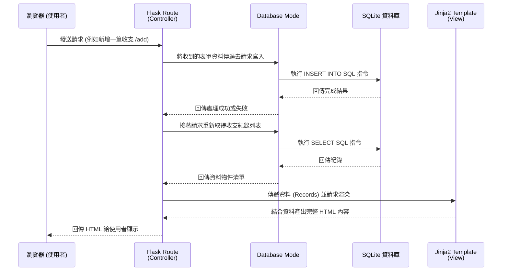

# 系統架構設計文件 (Architecture)

## 1. 技術架構說明
本專案為「個人記帳簿」，採用以下技術棧進行開發：
- **後端框架：Python + Flask**
  身為輕量級的 Web 框架，Flask 適合快速開發 MVP，並且不需要過度臃腫的專案設定。
- **模板引擎：Jinja2**
  專案採用 Server-Side Rendering (SSR)，由 Flask 與 Jinja2 合作，在伺服器端將資料與 HTML 結合並渲染後直接回傳給瀏覽器顯示，不採用前後端分離架構。
- **資料庫：SQLite**
  適合中小型輕量專案，只需單一檔案存放資料，不須建置額外的資料庫伺服器服務。
- **前端技術：HTML + CSS + Vanilla JS**
  透過原生的網頁開發技術呈現畫面，運用簡單的 JS 進行表單驗證與基礎互動。

**Flask 目前擔任的角色 (類 MVC 模式)：**
- **Model (模型)**：主要放在 `models.py`，負責定義資料結構與進行資料庫存取操作（與 SQLite 銜接）。
- **View (視圖)**：Jinja2 所渲染的 HTML 模板 (`templates/`)，負責根據得到的資料產出最終畫面給使用者。
- **Controller (控制器)**：Flask 內的撰寫路由的函式 (`routes.py`)，接收瀏覽器請求後，呼叫對應的 Model，最後指定需要渲染的 View 回傳。

## 2. 專案資料夾結構

專案的結構樹狀圖與職責定義如下：

```text
personal_finance_tracker/
├── app/                  # 應用程式的主體
│   ├── __init__.py       # app 套件宣告與 Flask APP 初始化設定
│   ├── app.py            # 啟動應用程式的進入點 (Entry point)
│   ├── models.py         # 資料操作（Model），負責把對資料庫的存取包裝成函式
│   ├── routes.py         # 所有的路由設定（Controller），處理對應頁面的邏輯
│   ├── static/           # 靜態資源 (由前端載入使用)
│   │   ├── css/
│   │   │   └── style.css # 全域樣式設定
│   │   └── js/
│   │       └── main.js   # 額外前端 JS (例如刪除確認提示)
│   └── templates/        # Jinja2 的 HTML 模板 (View)
│       ├── base.html     # 共用骨架模板 (Navbar, Footer, CSS引入)
│       ├── index.html    # 首頁 (儀表板總覽與近期紀錄)
│       └── form.html     # 新增或編輯紀錄的表單頁面
├── docs/                 # 開發文件存放處
│   ├── PRD.md            # 產品需求文件
│   └── ARCHITECTURE.md   # [本文件] 系統架構設計
├── instance/
│   └── database.db       # SQLite 自動生成的資料庫檔案
├── .gitignore            # Git 忽略清單 (忽略 instance/, __pycache__/ 等)
└── README.md             # 說明書
```

## 3. 元件關係圖

以下使用序列圖展示，在這個設計下的元件互動流程：



## 4. 關鍵設計決策

1. **Server-Side Rendering (SSR) 不使用前後端分離 API 架構**
   - **原因**：目前目的是驗證核心業務邏輯且能盡快完成 MVP，建立 RESTful APIs 並整合前端框架 (如 React) 會大幅增加時程與困難度。直接讓 Flask + Jinja2 處理視圖能最快得到成果，也很適合此種個人記帳運用。
2. **SQLite 為唯一的資料儲存管道**
   - **原因**：不需要設定環境即可執行，容易維護與擴展。未來若專案持續擴大，只須變更連線字串而轉向 PostgreSQL 或 MySQL 即可。
3. **將路由與資料庫層分離 (`routes.py` vs `models.py`)**
   - **原因**：把資料庫操作分開成 Model 層有助於未來如果我們想要針對資料存取加入新邏輯（比如說加上建立時間欄位、或者是格式化貨幣），可以不用動到 Controller。
4. **採用 `base.html` 基礎模板繼承**
   - **原因**：透過 Jinja2 的模板繼承減少程式碼的重複開發。將導覽列（包含總餘額、首頁連結、新增收支等重要捷徑）置於 base 模板，在不同頁面都有固定排版。
