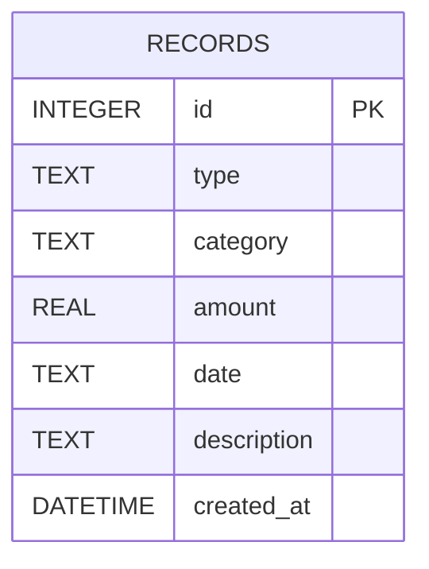

# 資料庫設計文件 (DB Design)

## 1. ER 圖（實體關係圖）

身為一個輕量級記帳工具，本系統主要使用單一資料表 `records` 來存放所有的收入與支出明細，以符合 MVP 的規劃。

## 2. 資料表詳細說明

### `records` 表 (收支紀錄資料表)
這是本系統最核心的資料表，負責紀錄使用者發生的每一筆金流明細。

| 欄位名稱 | 型別 | 必填 | 說明 |
| --- | --- | --- | --- |
| `id` | INTEGER | 是 | Primary Key，自動遞增的唯一主鍵 |
| `type` | TEXT | 是 | 收支類型，限定填入 `'income'` (收入) 或 `'expense'` (支出) |
| `category` | TEXT | 是 | 分類標籤 (例如：餐飲、交通、薪資、娛樂等) |
| `amount` | REAL | 是 | 交易金額 (使用 REAL 以支援小數點，或是整數金額) |
| `date` | TEXT | 是 | 交易發生日期，儲存格式為 ISO 8601 的 `YYYY-MM-DD` |
| `description` | TEXT | 否 | 使用者選填的備註描述 |
| `created_at` | DATETIME | 是 | 紀錄建立的時間戳記，預設為 `CURRENT_TIMESTAMP` |

## 3. SQL 建表語法
建立本資料表的原始 SQL SQLite 語法，已經匯出儲存至 `database/schema.sql` 檔案中，可用於初始化系統資料庫。

## 4. Python Model 程式碼
配合架構設計 (`ARCHITECTURE.md`) 的規劃，我們不採用大型 ORM，而是自製輕巧的 Model 層操作。  
該操作被封裝為 `RecordModel` 類別，儲存於 `app/models.py` 之中。當中包含了完整的 CRUD (Create, Read, Update, Delete) 靜態函式，提供給未來的 Flask Route 呼叫：
- `create(...)`: 新增紀錄
- `get_all()`: 取得所有紀錄並依照日期最新遞減排序
- `get_by_id(id)`: 取得單筆詳細資料
- `update(...)`: 更新該筆紀錄
- `delete(id)`: 刪除該筆紀錄
