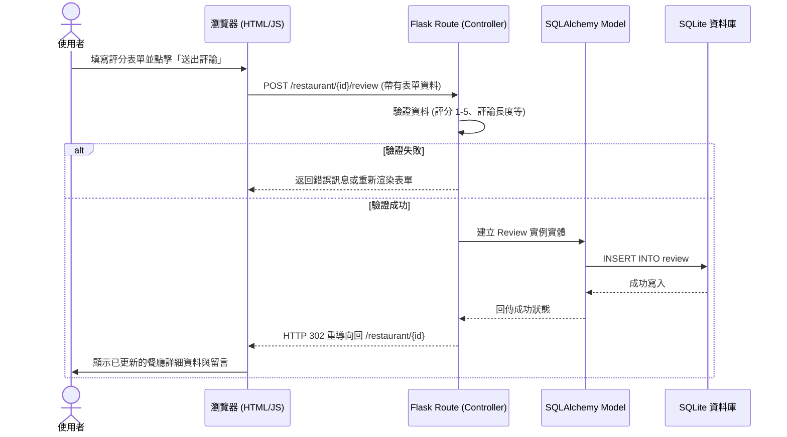

# 流程圖設計 (FLOWCHART)

根據校園美食推薦平台的 PRD 與 ARCHITECTURE 文件，本文件梳理出使用者的操作流程（User Flow）、系統處理的時序關係（Sequence Diagram），以及對應的路由端點清單。

## 1. 使用者流程圖（User Flow）

呈現使用者從進入網站開始，到達評分或新增餐廳等核心功時的操作路徑。

```mermaid
flowchart TD
  A([使用者開啟網站]) --> B[首頁 - 美食地圖與列表]
  
  B --> C[點擊地圖上的美食標記]
  B --> D[使用關鍵字搜尋]
  B --> E[點擊「新增餐廳」按鈕]
  
  D --> D1[顯示搜尋結果列表]
  D1 --> C1[點擊特定餐廳]
  C --> C1
  
  C1 --> F[進入餐廳詳細資料頁]
  F --> G[查看地址、營業時間與過往評論]
  F --> H[點擊「撰寫評論」]
  H --> I[填寫評分(1-5星)與文字內容]
  I --> J([送出並即時更新於評論區])
  
  E --> E1[進入新增餐廳表單頁面]
  E1 --> E2[填寫餐廳名稱、分類、地址等資訊]
  E2 --> K([送出並返回首頁，地圖新增該標記])
```

## 2. 系統序列圖（Sequence Diagram）

以「使用者提交餐廳評分與評論」的流程為例，展示前端、Flask 路由、Model 和資料庫之間的互動。



## 3. 功能清單對照表

系統中所有主要功能對應的 URL 路徑與 HTTP 方法整理如下：

| 功能名稱 | URL 路徑 | HTTP 方法 | 說明 |
| :--- | :--- | :--- | :--- |
| **首頁 (地圖與綜合列表)** | `/` | GET | 呈現首頁視圖，載入 Jinja2 模板與 Google/Leaflet 地圖介面 |
| **取得所有餐廳座標資料** | `/api/restaurants` | GET | 提供給前端 JS 繪製地圖 Marker 用的 JSON 格式資料 |
| **搜尋餐廳** | `/search` | GET | 透過 query 參數傳送關鍵字並渲染搜尋結果列表 |
| **查看餐廳詳細資料** | `/restaurant/<int:id>` | GET | 顯示該餐廳的詳細資訊與底下所有過往留言與評分 |
| **新增餐廳 (查看表單)** | `/restaurant/new` | GET | 渲染新增餐廳的 HTML 表單頁面 |
| **新增餐廳 (送出資料)** | `/restaurant/new` | POST | 接收表單內容並寫入 `Restaurant` 資料庫表 |
| **新增留言與評分** | `/restaurant/<int:id>/review` | POST | 接收該餐廳的評價內容並寫入 `Review` 資料庫表 |
